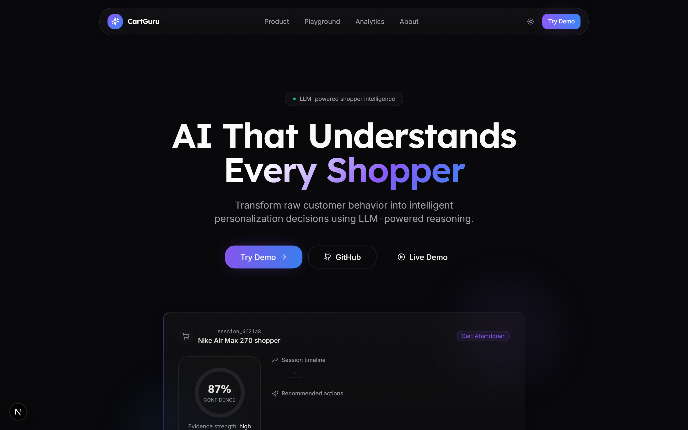
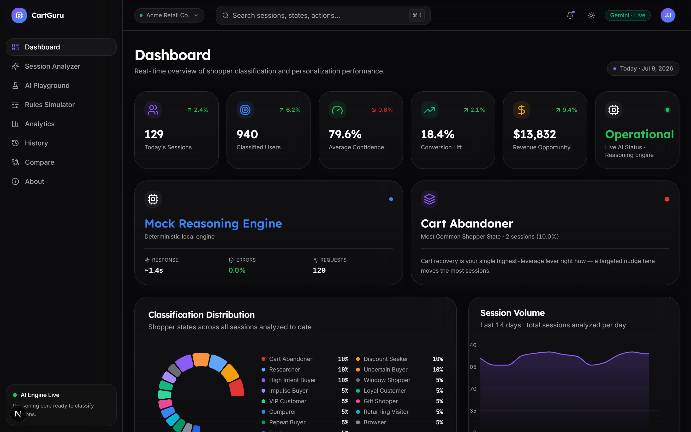
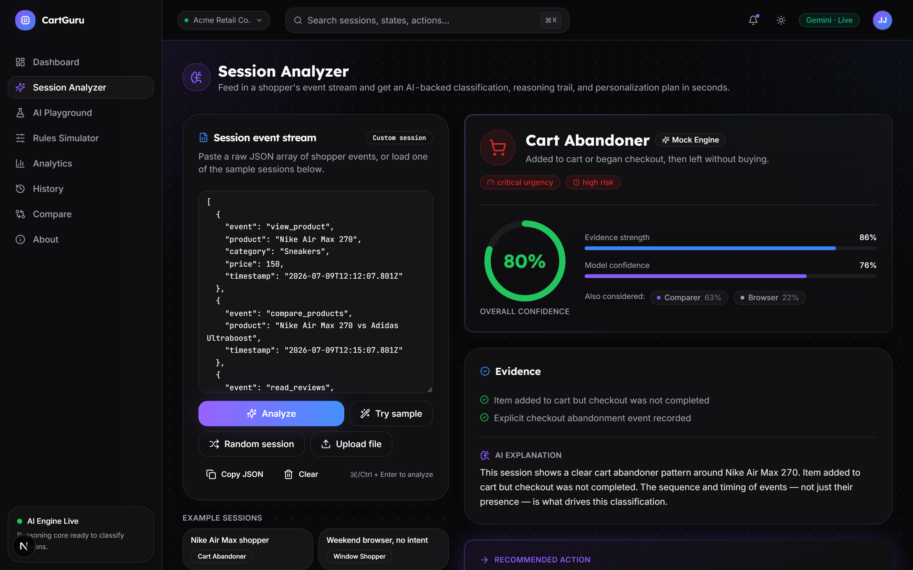
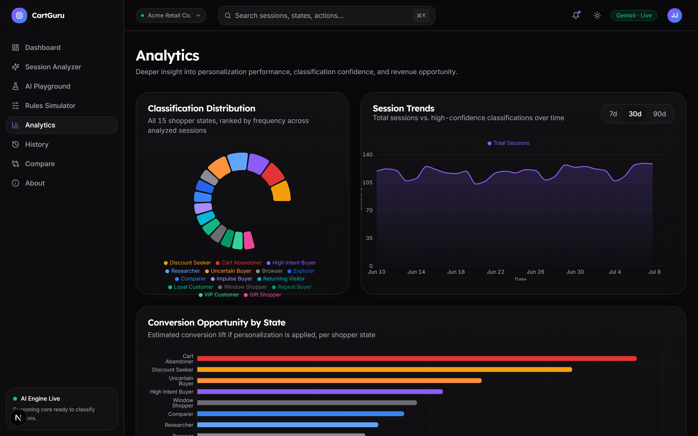

<div align="center">

# CartGuru

**AI-Powered Ecommerce Personalization Rules Engine**

*Understand every shopper. Personalize every journey.*

[](https://nextjs.org)
[](https://react.dev)
[](https://www.typescriptlang.org)
[](https://tailwindcss.com)
[](https://ai.google.dev)
[](#)

</div>

<br />

CartGuru turns raw ecommerce event streams into explainable, business-grade personalization decisions. It doesn't classify shoppers with an if/else tree — it reasons about behavior the way a senior CRO consultant would: weighing sequence and timing, citing evidence, considering and rejecting alternatives, and recommending the single highest-leverage action with an estimated revenue impact.

<br />

## Contents

| | | |
|---|---|---|
| [Overview](#overview) | [The AI Workflow](#the-ai-workflow) | [Design Decisions](#design-decisions--tradeoffs) |
| [Live Demo](#live-demo) | [Prompt Engineering](#prompt-engineering) | [Why Gemini](#why-gemini) |
| [Architecture](#architecture) | [Tech Stack](#tech-stack) | [Future Improvements](#future-improvements) |
| [Folder Structure](#folder-structure) | [Installation](#installation) | [Screenshots](#screenshots) |
| [Features](#features) | [Environment Variables](#environment-variables) | [Deployment](#deployment) |

<br />

## Overview

Ecommerce teams sit on huge amounts of behavioral event data (`view_product`, `add_to_cart`, `compare_products`, `abandon_checkout`...) but most personalization tooling still triggers off single events with static rules. CartGuru instead asks an LLM to read the **whole session** — the order, timing, and combination of events — and produce a structured verdict:

| Output | What it means |
|---|---|
| **Shopper State** | One of 15 states — Cart Abandoner, Discount Seeker, VIP Customer, Researcher, and more |
| **Confidence** | Overall confidence, plus separate evidence-strength and model-confidence scores |
| **Evidence** | Specific, event-grounded justifications — never invented |
| **AI Explanation** | A CRO-expert-style narrative of *why* |
| **Recommended Action** | The single highest-leverage personalization move |
| **Expected Business Impact** | Conversion lift and estimated revenue opportunity |
| **Alternatives Considered** | Competing classifications and why they were rejected |
| **Full Reasoning Trace** | Observed behaviors, important vs. ignored signals, and business strategy — surfaced transparently, not hidden behind a black box |

<br />

## Live Demo

Run locally (see [Installation](#installation)) — the app is fully demoable with **zero configuration**. Without a `GEMINI_API_KEY`, CartGuru automatically falls back to a deterministic, expert-authored reasoning engine that produces the exact same structured output shape as the live model.

<br />

## Architecture

```
┌─────────────────────────────────────────────────────────────────┐
│                           Client (Next.js)                       │
│                                                                    │
│  Landing → Dashboard → Session Analyzer → Rules Simulator         │
│                              │                  │                 │
│                       AI Playground        Analytics              │
│                              │                  │                 │
│                          History ──────────► Compare              │
│                                                                    │
│   Zustand store (session events, analysis, chat, persisted       │
│   history) shared app-wide — history survives reload via         │
│   localStorage                                                   │
└───────────────────────────────┬───────────────────────────────────┘
                                 │ fetch()
┌───────────────────────────────▼───────────────────────────────────┐
│                    API Routes (Next.js Route Handlers)            │
│                                                                     │
│   POST /api/analyze   — validate (Zod) → analyzeSession()         │
│   POST /api/chat      — validate (Zod) → chatAboutSession()       │
│   GET  /api/ai-status — exposes Gemini-configured status          │
└───────────────────────────────┬───────────────────────────────────┘
                                 │
┌───────────────────────────────▼───────────────────────────────────┐
│                        AI Service Layer                           │
│                                                                     │
│   isGeminiConfigured()?                                           │
│        │                                                            │
│        ├─ Yes → buildAnalysisPrompt() → Gemini 2.0 Flash          │
│        │         (structured JSON output) ── on failure ──┐       │
│        │                                                    │       │
│        └─ No  → runMockAnalysis()  ◄─────────────────────────┘     │
│                  (deterministic, signal-scored reasoning engine)  │
└─────────────────────────────────────────────────────────────────┘
```

Both paths — real Gemini and the mock engine — return the **exact same `SessionAnalysis` type**, so every UI component is written once against a single contract and is completely agnostic to which reasoning path produced it. This is the core architectural decision that makes the product reliably demoable.

<br />

## Folder Structure

```
src/
├── app/
│   ├── page.tsx                  # Landing page (marketing, outside app shell)
│   ├── (app)/                    # Route group wrapped in the dashboard shell
│   │   ├── layout.tsx            # Sidebar + topbar shell
│   │   ├── dashboard/
│   │   ├── analyzer/             # Session Analyzer (core feature)
│   │   ├── simulator/            # Rules Simulator
│   │   ├── analytics/
│   │   ├── playground/           # AI chat
│   │   ├── history/              # Saved analyses (persisted)
│   │   ├── compare/              # Side-by-side session comparison
│   │   └── about/
│   └── api/
│       ├── analyze/route.ts
│       ├── chat/route.ts
│       └── ai-status/route.ts    # Exposes Gemini-configured status to client components
├── components/
│   ├── ui/                       # shadcn-style primitives (button, card, badge, dropdown-menu, accordion, ...)
│   ├── layout/                   # sidebar, topbar, command palette, app shell, theme toggle
│   ├── landing/
│   ├── dashboard/
│   ├── analyzer/                 # AI output card, confidence meter, timeline, reasoning panel, state header
│   ├── simulator/
│   ├── analytics/
│   ├── playground/
│   ├── history/                  # History toolbar + card list
│   └── compare/                  # Comparison summary, diff rows, side-by-side columns
├── lib/
│   ├── ai/
│   │   ├── prompt.ts              # System persona + structured prompt builders
│   │   ├── gemini.ts              # Gemini client wrapper
│   │   ├── mock-engine.ts         # Deterministic fallback reasoning engine
│   │   └── analyze.ts             # Unified service: picks Gemini or mock, identical output shape
│   ├── hooks/use-run-analysis.ts  # Shared fetch-to-/api/analyze flow (Analyzer + History duplicate)
│   ├── data/mock-sessions.ts      # 20 realistic, varied mock ecommerce sessions
│   ├── store/session-store.ts     # Zustand store, persisted history (localStorage)
│   ├── chart-theme.ts             # Theme-aware color mapping for all charts (dark + light)
│   ├── theme.ts                   # Light/dark theme read/write + FOUC-avoiding init script
│   └── utils.ts
└── types/
    ├── events.ts                  # SessionEvent, EventType, EVENT_LABELS
    └── shopper.ts                 # ShopperState, SessionAnalysis, SavedAnalysis, all AI output types
```

<br />

## Features

| Page | What it does |
|---|---|
| **Session Analyzer** | Paste, upload, or drag-and-drop a raw JSON event stream; watch a 5-phase reasoning indicator, then get a full AI verdict — evidence, confidence meter, timeline, reasoning panel, and ranked recommendations — revealed with a staged section-by-section animation |
| **Rules Simulator** | Interactively add, remove, or reorder events and watch the AI reclassify in near real time |
| **AI Playground** | Chat with the model about *why* it made a call, what would change its mind, or what to do next |
| **Dashboard** | Animated counters, AI Health status, most-common-shopper-state, classification distribution, session trends, recent activity, workspace switcher, and theme toggle |
| **Analytics** | Deeper charts — distribution, trends, conversion opportunity by state, revenue heatmap (lazy-loaded for a lighter initial page weight) |
| **History** | Every analysis is automatically saved (localStorage-persisted, survives reload); search, filter, sort, favorite, duplicate, delete, and reopen past analyses |
| **Compare** | Pick two saved analyses and see a side-by-side breakdown — headline deltas, timelines, and recommendations |
| **About** | Product story, shopper-state glossary, and design philosophy |

**Also included:** JSON/CSV export, print-ready PDF reports, rich clipboard sharing, a full dark + light theme system, a command palette (⌘K), toast notifications, keyboard shortcuts, and empty/loading/error states throughout.

<br />

## The AI Workflow

1. **Input** — a shopper session as an ordered array of events (`view_product`, `compare_products`, `add_to_cart`, `abandon_checkout`, ...), each optionally carrying product, price, category, and timestamp metadata.
2. **Reasoning** — the model (or the mock engine's signal-scoring heuristics) evaluates the *sequence*, not just event counts: a coupon attempt followed by exit reads differently than a coupon attempt followed by purchase.
3. **Structured output** — a strict JSON contract (`SessionAnalysis`) covering classification, confidence breakdown, evidence, alternatives, a full reasoning trace, and ranked recommendations.
4. **Presentation** — the UI never re-interprets or invents anything the model didn't say; it renders the reasoning trace transparently (Observed Behaviors → Important Signals → Ignored Signals → Reasoning → Final Decision → Business Strategy → Why Not Others), the same way a good CRO consultant would walk you through their thinking.

<br />

## Prompt Engineering

The system persona (`src/lib/ai/prompt.ts`) explicitly instructs the model to act as **a senior CRO consultant and customer behavior analyst**, and enforces:

- Never behave like a simple if/else classifier — reason about sequence and timing
- Every claim must cite specific evidence from the actual event stream — never hallucinate behavior
- Be decisive: exactly one primary state, with genuine alternatives only when ambiguity is real
- Think in business terms: revenue, urgency, and risk — not just labels
- Confident, expert tone — no hedging filler
- Strict JSON output matching the `SessionAnalysis` schema, validated against the same Zod-backed contract used by the mock engine

<br />

## Tech Stack

| Layer | Choice |
|---|---|
| Framework | Next.js 15 (App Router), React 19 |
| Language | TypeScript (strict) |
| Styling | Tailwind CSS + custom design token system (dark + light) |
| Components | shadcn/ui pattern (Radix primitives) |
| Motion | Framer Motion |
| Charts | Recharts |
| State | Zustand (with `persist` middleware for History) |
| Forms/Validation | React Hook Form + Zod |
| AI | Google Gemini API (`gemini-2.0-flash`) |
| Icons | Lucide |

<br />

## Installation

```bash
npm install
cp .env.local.example .env.local   # optional — see below
npm run dev
```

Visit `http://localhost:3000`.

<br />

## Environment Variables

```
GEMINI_API_KEY=   # optional — get one at https://aistudio.google.com/apikey
```

**Without a key**, CartGuru runs entirely on its deterministic mock reasoning engine — same output contract, same UI, no network dependency. **With a key**, every analysis and playground chat call routes to Gemini 2.0 Flash, with automatic fallback to the mock engine if the API call fails for any reason.

<br />

## Design Decisions & Tradeoffs

- **Dual reasoning path over a single hard Gemini dependency** — a recruiter or reviewer can clone the repo and see the full product working in 60 seconds with no API key setup. The tradeoff is maintaining two reasoning implementations against one contract; the payoff is a demo that never breaks on a missing key.
- **Zustand over React Context** — session/analysis/chat/history state is read and written from seven different pages. Context would mean either one sprawling provider or prop-drilling; Zustand gives a single, typed, minimal-boilerplate store any component can subscribe to without a provider tree.
- **Structured JSON output over free-text parsing** — the prompt enforces a strict schema so the UI never has to fuzzy-parse model prose. This also makes the mock engine and the real model interchangeable at the type level.
- **Native reorder controls over a drag-and-drop library** — the Rules Simulator needed reordering, not a general-purpose DnD system. Up/down controls (plus native HTML5 drag where implemented) avoid pulling in a dependency for a narrow interaction.
- **localStorage over a backend for History** — saved analyses persist via Zustand's `persist` middleware (already a zero-cost part of the installed `zustand` package) rather than a database. This keeps the "clone and run" story intact — no schema, no auth, no hosted state — while still delivering real persistence across reloads. The tradeoff is no cross-device sync; a real product would eventually move this to a backend, which is exactly what `SavedAnalysis`'s clean separation from `SessionAnalysis` is designed to make painless later.
- **Print-based PDF export over a PDF library** — "Export PDF" reuses the exact same live components (`AiOutputCard`, `AnalysisStateHeader`) under a `printMode` prop and `@media print` CSS, then calls `window.print()`. This guarantees the exported report always visually matches the product and adds zero new dependencies, at the cost of relying on the browser's native print-to-PDF rather than a pixel-perfect generated file.

<br />

## Why Gemini

Gemini 2.0 Flash was chosen for its native structured-output mode (`responseMimeType: "application/json"`), low latency (important for a UI that shows a live "reasoning" indicator rather than a long spinner), and generous free-tier limits that make this genuinely runnable by anyone evaluating the project without a billing setup.

<br />

## Future Improvements

- Move Saved Analyses from localStorage to a real database for cross-device sync
- Streaming AI responses (token-by-token) in both the Analyzer's reasoning panel and the Playground chat — the current staged reveal simulates this at the UI layer, but the underlying response is still a single structured JSON payload
- Multi-session cohort analysis (classify and compare more than two shoppers at once — Compare currently supports exactly two)
- A/B test simulation for recommended actions against historical conversion data
- User accounts, saved rule sets, and exportable personalization rules for real ESP/CDP integration
- Automated eval suite comparing mock-engine and Gemini classifications on a labeled test set
- Real persistent shareable links (would require backend/KV persistence beyond today's clipboard-based share)

<br />

## Screenshots

| Landing | Dashboard |
|---|---|
|  |  |

| Session Analyzer | Analytics |
|---|---|
|  |  |

<br />

## Deployment

Deploy to [Vercel](https://vercel.com):

```bash
vercel
```

Set `GEMINI_API_KEY` in the Vercel project's environment variables to enable live reasoning; omit it to ship with the mock engine only.

<br />

<div align="center">

Built with Next.js, React, and Gemini.

</div>
